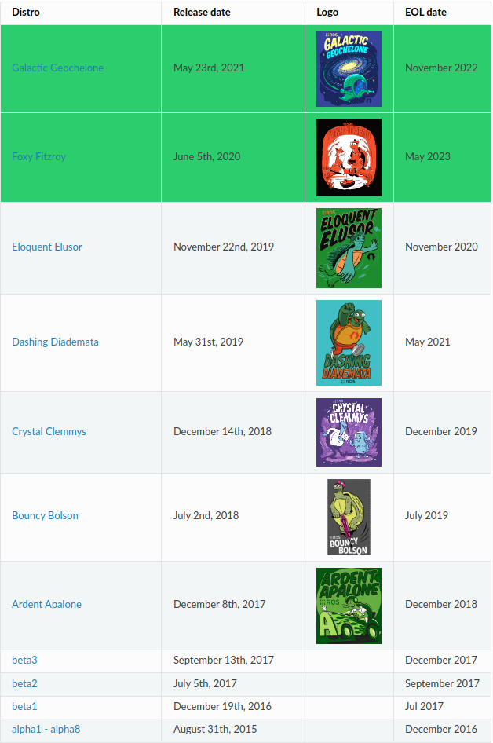

# 1.1 ROS2的前世今生

要说ROS2，那就不得不提起ROS，ROS就是传说中的机器人操作系统，英文全称（Robot Operating System），但ROS本身并不是一个操作系统，而是可以安装在现在已有的操作系统上（Linux、Windows、Mac）上的**软件库和工具集**。

ROS出生于2007年，所以它的年龄比也许比大家都要小。ROS的出现解决了机器人各个组件之间的通信问题，同时基于ROS的连接机制，有非常多的优秀的算法集成到了ROS中来。

现在的ROS已经变得非常的丰富和强大。但一些原始的架构和设计不能够满足目前的使用需求，这也是ROS2出现的原因。

ROS2继承了ROS原有的优秀之处，同时又带来了很多新的功能,ROS2相对于ROS更加的强大和完善。

### ROS为什么会出现？

> ROS的设计目的是：简化在各种机器人平台上创建复杂而强大的机器人行为的任务

在ROS没有出现之前，做一个机器人是非常复杂的一件事情，因为一个机器人需要涉及到多个部分，而且这些部分之间还要进行通信。

例如设计一个像下图一样的轮式移动机器人，我们对其进行拆解。可以分为**感知、决策、控制**三个部分。

- **感知部分**有：激光雷达、深度相机、IMU、里程计、碰撞感知
- **决策部分**有：建图、路径规划（navigation）算法、定位算法
- **控制部分**有：轮子驱动

机器人复杂之处就在于此，如果想要整个机器人可以跑起来，那么必须要有一个东西将上面的几个部分合理的连接到一起，这个东西就是ROS。

ROS的作用就像我们的身体的神经系统一样，通过神经系统将我们身体的各个部分接入大脑。

### ROS2很年轻吗？

答案并不是，ROS2第一个`alpha1 - alpha8`版本从2015年8月31号就开始了，截至到目前（2021年7月）已经发布了11个版本（9个已经不再更新），所以ROS并不年轻。

### 小鱼会选择哪个版本进行讲解？

截至到现在，国内包括目前网上教程最多的`Dashing`版本截至到今年（2021）的5月份官方也不再更新了。

所以本教程将会采用的版本为ros2目前第一个较长期（到2023年5月）支持的`foxy`版本进行讲解。

### ROS2版本对照表

参考资料：

ROS2官方更新计划：http://docs.ros.org/en/foxy/Releases.html
