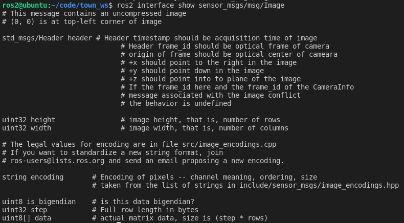

4.13 ROS2原始数据类型与接口

在ROS2中定义接口，需要编写一个接口文件，该文件后缀为`msg`、`srv`、`action`。

在接口文件中定义通信过程中所使用的数据类型和数据名称，那可用的数据类型和数据名称有哪些呢？今天小鱼就带你详细了解一下ROS2接口文件中的数据类型和数据名称。

1.数据名称

数据名称就是一个字符串，没啥好说的，符合编程语言变量的命名规则就行（比如不能是字母开头）。

2.数据类型

2.1 数据类型有哪些呢？

这里小鱼可以告诉你，原始的数据类型只有九类。其中每一个都可以在后面加上`[]`将其变成数组形式（从一个变成多个）

```
bool
byte
char
float32, float64
int8, uint8
int16, uint16
int32, uint32
int64, uint64
string
```

> 上面这九类中，官方也在考虑新增一些和删除一些，目前还是支持的，后续小鱼会根据资料再更新一下本文。

2.2 类型扩展

ROS2基于上面的九类基础数据类型，为我们定义出了很多拿来就用的数据类型，比如我们在前面章节中用到的图像数据类型`sensor_msgs/Image`,我们可以使用下面的命令来看一下其组成：

```
ros2 interface show sensor_msgs/msg/Image
```



去掉单行的注释后的样子如下：

```
std_msgs/Header header # Header timestamp should be acquisition time of image
uint32 height                # image height, that is, number of rows
uint32 width                 # image width, that is, number of columns
string encoding       # Encoding of pixels -- channel meaning, ordering, size
uint8 is_bigendian    # is this data bigendian?
uint32 step           # Full row length in bytes
uint8[] data          # actual matrix data, size is (step * rows)
```

我们可以看到，除了第一行

```
std_msgs/Header header # Header timestamp should be acquisition time of image
```

之外的其他部分都是由基础类型及其数组形式组成。

