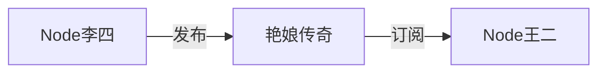

# 4.1 ROS2话题介绍

你好，我是小鱼。你还记的ROS镇的故事吗？后来ROS2镇长来了之后，王二订报的方式也发生了改变,让我们一起来看看吧。

## 1.讲个故事

李四是一名擅长写小说的作家，王二是一名喜欢看小说且单身多年的单身狗。王二最喜欢看李四写的《艳娘传奇》这个小说。

所以王二（Node）出于对《艳娘传奇》（Topic）的兴趣，订阅了（Subscribe）李四（Node）发布（Publish）的小说。

## 2.话题介绍

看完上面的内容，我们来总结一下，上面其实讲了一下ROS2中Topic通信方式。Topic是一种发布订阅模型。

订阅者（王二）需要通过订阅话题（艳娘传奇）来获取发布者（李四）的发布的《艳娘传奇》的具体内容。

`李四王二通信模型`还是一对一（一个发布者，一个订阅者）的模型，ROS2中其实是可以`1对n`,`n对1`,`n对n`的。

### 话题通信有哪些需要注意的规则呢？

并且满足以下规则：

- 话题名字是关键，订阅者必须知道话题的名称才能完成订阅;
- 同一个人可以订阅多个话题，同时也可以发布多个话题，就像一本书的作者也可以是另外一本书的读者;
- 同一个小说不能有多个作者（版权问题），但同一个话题可以有多个发布者。

3.

