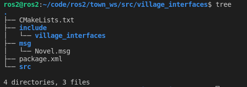
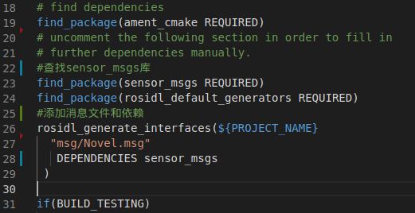
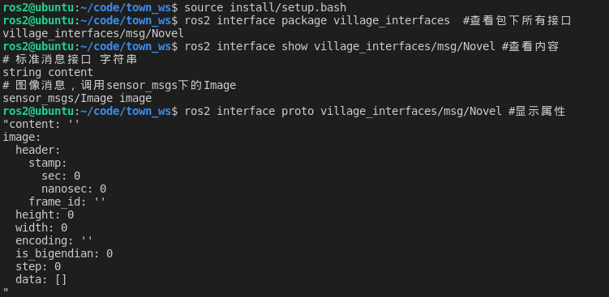

# 4.6 自定义话题接口

本节小鱼带大家一起新建一个消息接口，帮李四的艳娘传奇每一章插入一图。

## 1.如何自定义话题接口

通过前几节的学习大家已经明白，话题是一种单向通信的接口，同一个话题只能由发布者将数据传递给订阅者，所以定义话题接口也只需要定义发布者所要发布的类型即可。

在实际的工程当中，为了减少功能包互相之间的依赖，通常会将接口定义在一个独立的功能包中，所以小鱼会新建一个叫做`village_interfaces`的功能包，并把所有ROS镇下的接口都定义在这个独立的功能包里。

有了功能包之后，我们就可以新建话题接口了，新建方法如下：

- 新建msg文件夹，并在文件夹下新建`xxx.msg`
- 在xxx.msg下编写消息内容并保存
- 在CmakeLists.txt添加依赖和msg文件目录
- 在package.xml中添加xxx.msg所需的依赖
- 编译功能包即可生成python与c++头文件


## 2.开始动手

### 2.1新建工作空间

在town_ws的src文件夹下，运行下面的指令，即可完成`village_interfaces`功能包的创建。

>  注意，这里包的编译类型我们使用ament_cmake方式。

```
ros2 pkg create village_interfaces --build-type ament_cmake 
```


进入`village_interfaces`文件夹，使用tree指令查看，目录结构如下：



### 2.2 新建msg文件夹和Novel.msg(小说消息)

> 大家直接用vscode鼠标新建文件夹和新建文件就行，小鱼写个命令行装一下X
> 注意:msg文件开头首字母一定要大写，ROS2强制要求，原因小鱼盲猜应该是为了和类名保持一致


进入`village_interfaces`下，运行下面的命令：

```
cd village_interfaces
mkdir msg
touch Novel.msg 
```

### 2.3编写Novel.msg内容

我们的目的是给李四的小说每一章增加一张图片，原来李四写小说是对外发布一个`std_msgs/msg/String`字符串类型的数据。

而发布图片的格式，我们需要采用ros自带的传感器消息接口中的图片`sensor_msgs/msg/Image`数据类型，所以我们新的消息文件的内容就是将两者合并，在`ROS2`中可以写做这样：

> 在msg文件中可以使用`#`号添加注释。

```
# 标准消息接口std_msgs下的String类型
std_msgs/String content
# 图像消息，调用sensor_msgs下的Image类型
sensor_msgs/Image image
```

这种组合结构图如下：
```mermaid
graph 
A[Novel.msg] -->B[std_msgs/String]
A[Novel.msg] -->C[sensor_msgs]
B[std_msgs] -->D[int32]
B[std_msgs/String content] -->G[string]
C[sensor_msgs] -->E[uint8]
C[sensor_msgs] -->G[string]
C[sensor_msgs/Image image] -->F[uint32]
```

这个图一共三层，第一层是消息定义层，第二层是ROS2已有的std_msgs,sensor_msgs，其组成关系是由下一层组合成上一层。

最下面一层`string、uint8、uint32`是ROS2中的原始数据类型，原始数据类型有下面几种，ROS2中所有的接口都是由这些原始数据类型组成。

```
bool
byte
char
float32,float64
int8,uint8
int16,uint16
int32,uint32
int64,uint64
string
```

#### 2.3.1 另一种写法

除了上面一种写法外，还有一种编写方式，那就是采用ROS2的原始类型来组合。
其实很简单，我们不使用std_msgs/String 而是直接使用最下面一层的string。

结构图就变成了这样子：
```mermaid
graph 
A[Novel.msg] -->C[sensor_msgs]
A[Novel.msg] -->G[Novel.msg]
C[sensor_msgs] -->G[string]
C[sensor_msgs/Image image] -->F[uint32]
C[sensor_msgs] -->E[uint8]
```

文件内容也变成了这样子：

```
# 直接使用ROS2原始的数据类型
string content
# 图像消息，调用sensor_msgs下的Image类型
sensor_msgs/Image image
```

#### 2.3.2 说明

小鱼是如何知道，std_msgs/String是由基础数据类型string组成的，其实可以通过下面的指令来查看

```
ros2 interface show std_msgs/msg/String
```

结果如下：

```
string data
```

原来std_msgs的String就是包含一个叫变量名为data的string类型变量，这也是在4.2和4.3章节中代码要用`.data`才能拿到真正的数据的原因：

```
from std_msgs.msg import String
msg = String()
msg.data = '第%d回：潋滟湖 %d 次偶遇胡艳娘' % (self.i,self.i)
# msg 是 std_msgs.msg.String() 的对象
# msg.data data是string类型的对象，其定义是string data
```

2.3.3 两种写法选哪一种

小鱼这里选择第二种写法，让大家既了解ROS2的原始数据类型也了解ROS2自带的消息接口包。

所以最后我们的Novel.msg文件内容如下：

```
# 直接使用ROS2原始的数据类型
string content
# 图像消息，调用sensor_msgs下的Image类型
sensor_msgs/Image image
```


### 2.4 修改CMakeLists.txt

完成了代码的编写还不够，我们还需要在`CMakeLists.txt`中告诉编译器，你要给我把Novel.msg转换成Python库和C++的头文件。

大家直接添加下面的代码到`CMakeLists.txt`即可。

```
#添加对sensor_msgs的
find_package(sensor_msgs REQUIRED)
find_package(rosidl_default_generators REQUIRED)
#添加消息文件和依赖
rosidl_generate_interfaces(${PROJECT_NAME}
  "msg/Novel.msg"
   DEPENDENCIES sensor_msgs
 )
```

`find_package`用于查找`rosidl_default_generators`位置，下面`rosidl_generate_interfaces`就是声明`msg`文件所属的工程名字、文件位置以及依赖DEPENDENCIES。

> `小鱼踩坑报告`：重点强调一下依赖部分DEPENDENCIES，我们消息中用到的依赖这里必须写上，即使不写编译器也不会报错，直到运行的时候才会出错。

添加完成后的`CMakeLists.txt`长这样



### 2.5修改`package.xml`

修改village_interfaces目录下的`package.xml`，添加下面三行代码，为工程添加一下所需的依赖。

> 这里其实不添加也可以，小鱼后面会跟大家讲一下，packages.xml的作用。

```
  <depend>sensor_msgs</depend>
  <build_depend>rosidl_default_generators</build_depend>
  <exec_depend>rosidl_default_runtime</exec_depend>
  <member_of_group>rosidl_interface_packages</member_of_group>
```

添加完成后代码位置在这里。


### 2.6 编译

编译功能包相信大家都很熟悉了，小鱼就不多说了。

回到`town_ws`

```
colcon build --packages-select village_interfaces
```


## 3.验证

写好了自定义的消息，我们如何验证呢？

最好的办法肯定是写上一段代码来测试一下，但因为篇幅原因，小鱼把它放在了本章的最后。

所以我们本节可以通过上节课说过的`ros2 interface`常用的命令来测试。

```
source install/setup.bash 
ros2 interface package village_interfaces  #查看包下所有接口
ros2 interface show village_interfaces/msg/Novel #查看内容
ros2 interface proto village_interfaces/msg/Novel #显示属性
```



## 4.总结

我们可以在步骤3的运行结果中看到，`Novel`的消息内容是由`content`数据和传感器数据`image`共同组成的了。

通过本节学习，相信你已经学会如何自定义话题了，下一节和小鱼一起认识一下服务吧~

