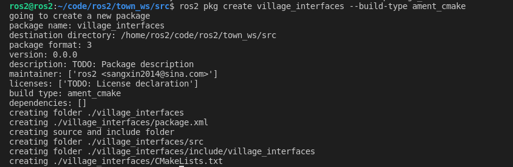

```
ros2@ros2:~/code/ros2/town_ws/src$ ros2 pkg create village_interfaces --build-type ament_cmake 
going to create a new package
package name: village_interfaces
destination directory: /home/ros2/code/ros2/town_ws/src
package format: 3
version: 0.0.0
description: TODO: Package description
maintainer: ['ros2 <sangxin2014@sina.com>']
licenses: ['TODO: License declaration']
build type: ament_cmake
dependencies: []
creating folder ./village_interfaces
creating ./village_interfaces/package.xml
creating source and include folder
creating folder ./village_interfaces/src
creating folder ./village_interfaces/include/village_interfaces
creating ./village_interfaces/CMakeLists.txt
```



