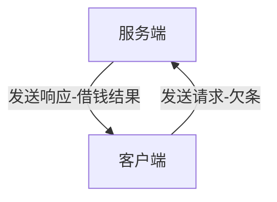

4.7 ROS2服务介绍

大家好，帅鱼又来蹬蹬蹬的游来了。本节小鱼将要带大家一起了解一下什么是服务。

还记的ROS镇的外卖服务吗？ROS2镇长上任之后，为了鼓励大家多多运动，就把外卖给取消了。后来镇里又发生了一些有意思的事情。

1.讲个故事

1.1 李三借钱

话说乡村作家李四通过写小说赚了不少钱，李四又是一个心地善良的人，于是他决定无利息借钱给村里的人，帮助大家。

李四三哥李三，比起李四就差太多了，整天游手好闲，除了白嫖李四小说外，听说李四无息对外借钱，就立马想过去捞一笔。但李四对外借钱是有规矩的,规矩如下：

1. 借钱一定要打欠条，收到欠条才能给钱
2. 每次借钱不能多于自己自己所有钱的10%且一定是整数，也就是说李四假如现在有100块钱，那么最多借出去`100x10%=10`块钱

李三看到之后心想，要写欠条，不能借太多不然以后`亲兄弟，明算账`起来，自己还不起也不行，于是打算先借10块钱搓一碗麻辣烫去。

1.2 王二出售盗版书

在李三算计着借钱吃麻辣烫的时候，隔壁王家村王二也在和张家村张三讨价还价着。

原来王二看着艳娘传奇卖的挺好，就准备自己复印盗版的卖给张三，但张三是个聪明的商人，他知道李四的那个售卖方式有问题（即使自己不给钱，也能拿到小说，但久了会被李四发现），所以张三即使是卖盗版，也是有规矩的：

1. 必须一手交钱，一手交货
2. 每次只卖手里的存量，每章一块钱，支持找零

张三一看，比正版的便宜一半，必须买。


2.服务介绍

看完上面的小故事，我们开始正式介绍一下服务。上面所说的李四对外借钱其实就可以理解为对外提供服务，我们将李四称为服务端，而李三要借李四的钱，李三我们称之为客户端。

客户端发送请求给服务端，服务端可以根据客户端的请求做一些处理，然后返回结果给客户端。



而王二向张三卖盗版的《艳娘传奇》也是服务-客户端模型，王二是提供盗版书的服务端，张三是购买盗版书的客户端。

> 不知道你有没有感觉到服务和话题的不同之处，话题是没有返回的，适用于单向或大量的数据传递。而服务是双向的，客户端发送请求，服务端响应请求。

同时服务还是有一些注意事项：

- 同一个服务（名称相同）只能有一个节点提供
- 同一个服务可以被多个客户端调用


3.体验服务

在我们安装ROS2的时候其实系统为我们安装了一些样例程序，其中就有服务使用样例，我们可以先来体验一下。

3.1 启动服务端

打开终端，运行下面的命令，这个命令用于运行一个服务节点，这个服务是用于

```
ros2 run examples_rclpy_minimal_service service
```


