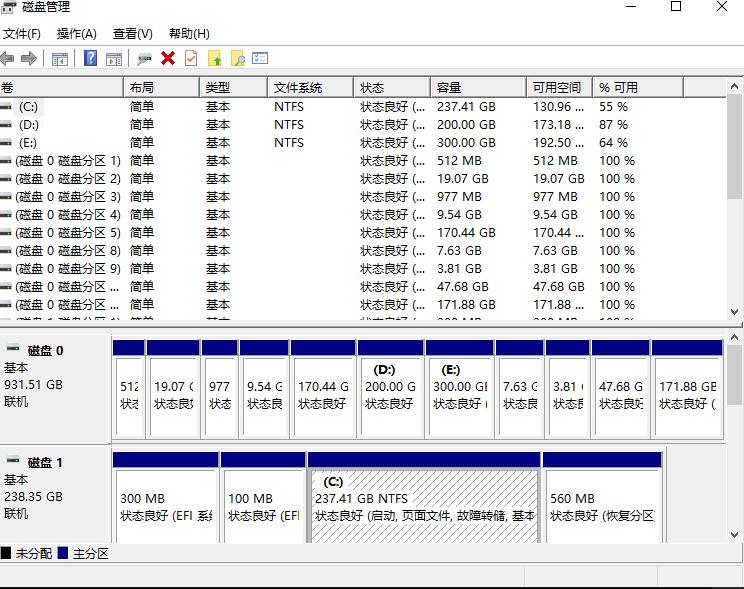
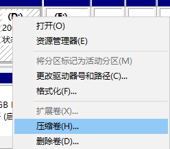
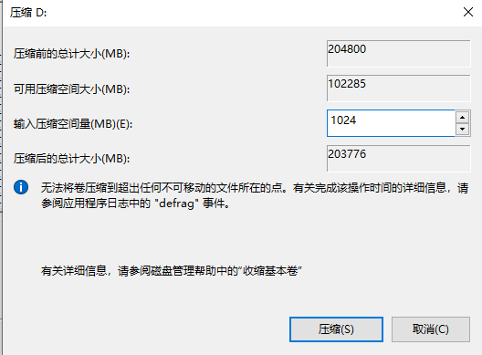
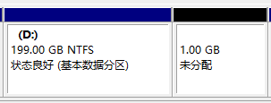

# 使用双系统安装Ubuntu

这节给大家讲一讲如何使用双系统的方式安装ubuntu，毕竟虚拟机还是虚拟的，是两个系统在分硬件资源，有时候会卡到怀疑人生，所以本节小智就给大家讲一讲如何安装双系统。

安装双系统需要准备哪些材料呢？
- U盘一个（大于4G）
- ubuntu镜像一个（下载可以点链接：[链接](http://mirrors.ustc.edu.cn/ubuntu-releases/20.04/ubuntu-20.04.2.0-desktop-amd64.iso)）
- U盘烧写工具**UltralSO**这个可以加入课程交流群下载**139707339**

准备好三个工具后，咱们就开干了

## 1 制作启动盘—烧录镜像

打开UltralSO

左上角文件，打开选择我们的镜像。

点击打开，确保电脑上插上了U盘。

点启动，写入硬盘映像

回跳出烧录界面

点击**写入**操作飞一会，Ubuntu20.04的启动盘就制作完成了。

这个时候看看电脑就会出现一个叫做ubuntu20.0的磁盘。

## 2 整理磁盘给出空间

如果你的电脑里连50个G的空闲空间都没有了，最好还是别装了。装双系统费钱吗？不费，但费磁盘容量。

小智这里流出了80G的空间用来安装ubuntu。具体怎么操作呢？

在窗口上右击，选择磁盘管理器。

你就能看到这样一个窗口。

这个窗口显示着你电脑上所有的磁盘和分区状态。

你可以找一块你没用的分区，右击压缩卷卷（一定要谨慎操作哦，不然这个磁盘都没了，心中默念数据无价，阿弥陀佛）

压缩卷的意思其实是把某个分区在分出来一部分。

比如小智在D盘上压缩，D盘剩余的空间都可以被压榨出来。

这里小智只压榨出来1024M=1G的空间来。

点击压缩后D盘就变成了199G，而且后面多出来了1G的未分配空间，这个未分配空间就可以用来安装linux的，大家至少压缩出来50G左右最好，小智一般给80G。

## 3 修改开机选项进入启动盘

待更新~
