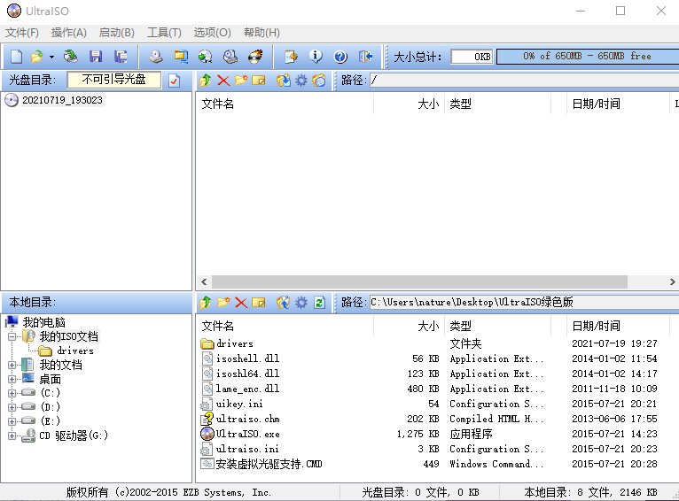
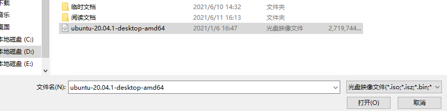
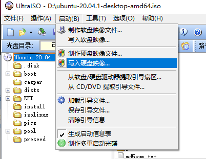
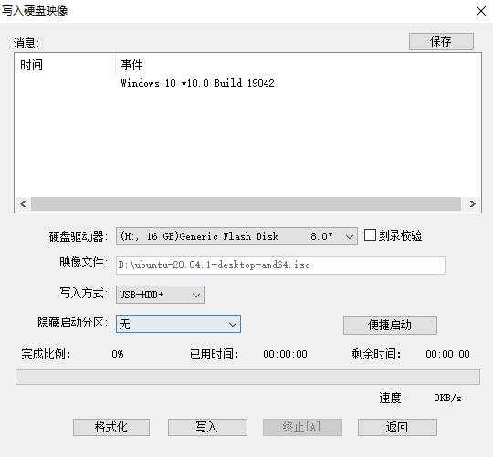
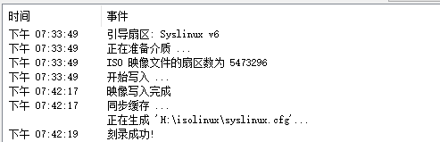
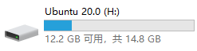

# 使用双系统安装Ubuntu

这节给大家讲一讲如何使用双系统的方式安装ubuntu，毕竟虚拟机还是虚拟的，是两个系统在分硬件资源，有时候会卡到怀疑人生，所以本节小智就给大家讲一讲如何安装双系统。

安装双系统需要准备哪些材料呢？
- U盘一个（大于4G）
- ubuntu镜像一个（下载可以点链接：[链接](http://mirrors.ustc.edu.cn/ubuntu-releases/20.04/ubuntu-20.04.2.0-desktop-amd64.iso)）
- U盘烧写工具**UltralSO**这个可以加入课程交流群下载**139707339**

准备好三个工具后，咱们就开干了

## 烧录镜像

打开UltralSO

左上角文件，打开选择我们的镜像。

点击打开，确保电脑上插上了U盘。

点启动，写入硬盘映像

回跳出烧录界面

点击**写入**操作飞一会，Ubuntu20.04的启动盘就制作完成了。

这个时候看看电脑就会出现一个叫做ubuntu20.0的磁盘。

