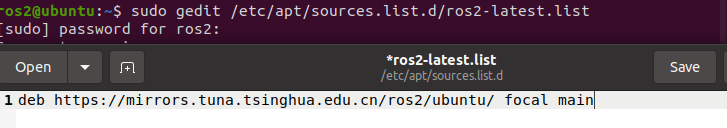

# 安装ROS2

到了这一节，终于可以开始安装ROS2了。小智接下来会讲的比较细一些，帮助一些没有基础的同学进行安装。

首先启动虚拟机或者启动双系统中的ubuntu。


## 添加国内的ROS2源

1. Ctrl+Alt+T打开终端

2. 新建 `/etc/apt/sources.list.d/ros2-latest.list`

   ```
   sudo gedit /etc/apt/sources.list.d/ros2-latest.list
   ```

3. 复制粘贴以下内容,然后保存

   ```
   deb https://mirrors.tuna.tsinghua.edu.cn/ros2/ubuntu/ focal main
   ```

   

   

4. 然后再输入如下命令，信任 ROS 的 GPG Key，并更新索引：

   ```
   sudo apt update && sudo apt install curl gnupg2 lsb-release
   curl -s https://raw.githubusercontent.com/ros/rosdistro/master/ros.asc | sudo apt-key add -
   sudo apt update
   ```

   > 中途遇到选y/n,一律y


**如果update出错,像下面这种就需要注意了,这是因为清华源同步的问题,我们就不用清华的源了.**

```shell
E: Failed to fetch https://mirrors.tuna.tsinghua.edu.cn/ros2/ubuntu/dists/focal/main/binary-i386/Packages  404  Not Found [IP: 101.6.8.193 443]
E: Some index files failed to download. They have been ignored, or old ones used instead.
```

接着运行下面的指令即可.

```
sudo curl -sSL https://raw.githubusercontent.com/ros/rosdistro/master/ros.key  -o /usr/share/keyrings/ros-archive-keyring.gpg
echo "deb [arch=$(dpkg --print-architecture) signed-by=/usr/share/keyrings/ros-archive-keyring.gpg] http://packages.ros.org/ros2/ubuntu $(lsb_release -cs) main" | sudo tee /etc/apt/sources.list.d/ros2.list > /dev/null
sudo apt-get update
```

> 如果遇到了其他问题,欢迎加入qq交流群进行交流:139707339
>

## 安装ROS2

上面步骤完成后,安装就变得非常的简单了,一行指令搞定;

```
sudo apt-get install ros-foxy-desktop
```

然后等着就行:


## 配置环境变量

虽然安装好了ros2,但ros2并没有加入到系统默认的环境中来,每次想用还需要进行source.有什么办法可以一劳永逸呢?

把ros2加入bashrc中.

两个指令就可完成


## 卸载

```
sudo apt remove ros-foxy-* && sudo apt autoremove
```

参考链接：

- ROS2 镜像使用帮助：https://mirrors.tuna.tsinghua.edu.cn/help/ros2/