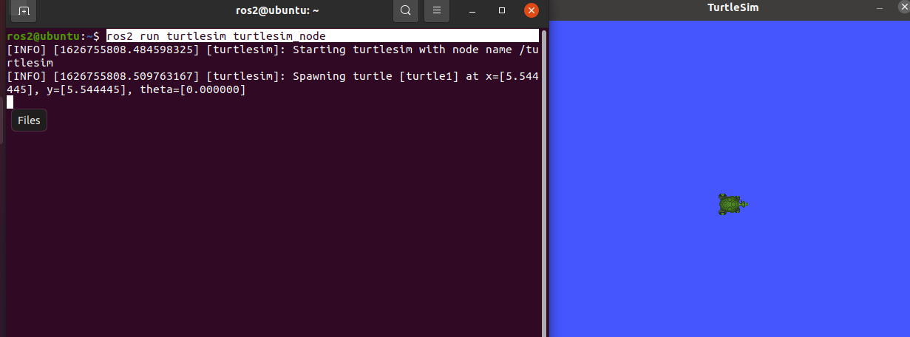

# 2.4 动手玩ROS2

## 1 游戏1:你说我听

游戏内容：很简单，我们启动两个节点，一个节点负责发消息(说)，一个节点负责收消息（听）。

> 就像上节课扩展阅读中的那样子，李四写《艳娘传奇》王二订阅《艳娘传奇》。

1. 启动一个终端Ctrl+Alt+T

2. 启动倾听者

   ```
   ros2 run demo_nodes_py listener
   ```

3. 启动一个新终端Ctrl+Alt+T

4. 启动说话者

   ```
   ros2 run demo_nodes_cpp talker
   ```

观察一下现象，talker节点每数一个输，倾听节点每一次都能听到一个，是不是很神奇。但为什么`listenr`听漏了两个数呢？这个我们放到视频教程里给大家说。


## 2 游戏2:龟龟大乱斗

游戏内容：启动海龟模拟器，启动海龟遥控器，控制海龟在地图上画出任意轨迹即可。

> 本来是控制海龟画个五角星的，但经过手动多次尝试，发现太难了。大家有时间可以试试，有搞定的可以发个图在群里分享一下。


### 启动海龟模拟器

打开终端Ctrl+Alt+T,输入下面的指令

```
ros2 run turtlesim turtlesim_node
```

就可以看到这样的界面



### 启动海龟遥控器

点一下原来的终端输入Ctrl+Shift+T 打开一个新的标签页输入

```
ros2 run turtlesim turtle_teleop_key
```

你可以看到这样子的界面


这个时候你就可以使用上下左右去遥控海龟了，快试一试吧。


## 3 总结

通过本节的小游戏，你应该对ROS2稍微熟悉了一丢丢，不过心中也会多出那么几个问题？比如：

为什么一个节点说，一个节点一定能听到？

为什么键盘可以控制小乌龟前进后退？

没关系，让我们继续往下，你会一点点的有了拨云见月的感觉。


欢迎大家加入ROS2的技术交流群，分享你的小乌龟。


