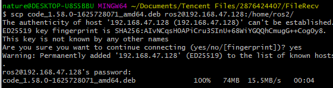

# 2.6 常规操作&&骚操作

## 1. 系统之间传文件方法

给ubuntu安装ssh-server

```shell
sudo apt-get install openssh-server 
Reading package lists... Done
Building dependency tree       
Reading state information... Done
```

查看ubuntu的ip地址

```shell
ros2@ubuntu:~$ ip a
1: lo: <LOOPBACK,UP,LOWER_UP> mtu 65536 qdisc noqueue state UNKNOWN group default qlen 1000
    link/loopback 00:00:00:00:00:00 brd 00:00:00:00:00:00
    inet 127.0.0.1/8 scope host lo
       valid_lft forever preferred_lft forever
    inet6 ::1/128 scope host 
       valid_lft forever preferred_lft forever
2: ens33: <BROADCAST,MULTICAST,UP,LOWER_UP> mtu 1500 qdisc fq_codel state UP group default qlen 1000
    link/ether 00:0c:29:f5:f4:82 brd ff:ff:ff:ff:ff:ff
    altname enp2s1
    inet 192.168.47.128/24 brd 192.168.47.255 scope global dynamic noprefixroute ens33
       valid_lft 1765sec preferred_lft 1765sec
    inet6 fe80::b7fe:7bf9:a134:bdb9/64 scope link noprefixroute 
       valid_lft forever preferred_lft forever
```

打开powershell或者terminal，输入

```shell
scp code_1.58.0-1625728071_amd64.deb ros2@192.168.47.128:/home/ros2/
```




## 2. 安装搜狗拼音输入法

这个教程还可以，一个下载链接，一个安装指南。一定要注意安装指南里的一次重启电脑和一次登出（LoginOut）

- 搜狗拼音：https://pinyin.sogou.com/linux/
- 安装指南：https://pinyin.sogou.com/linux/help.php

这里小智就不多说了，大家操作时候遇到问题百度一下，或者加群找大家寻求一下帮助~


